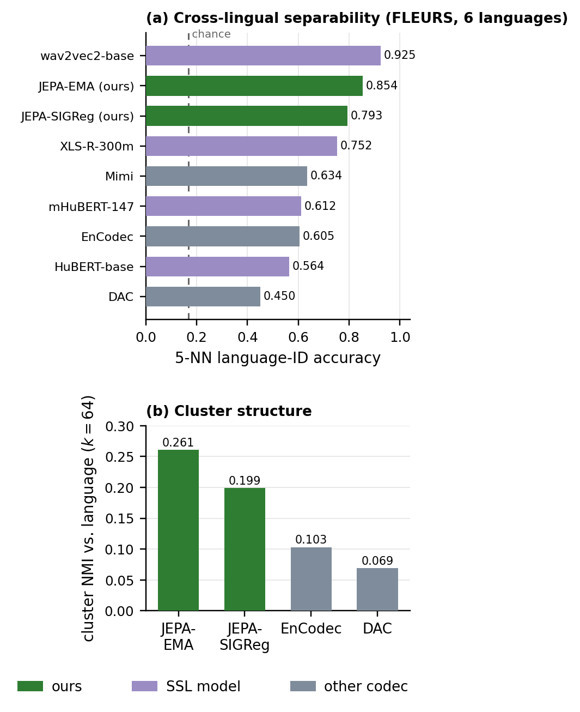
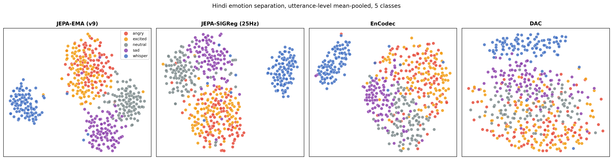

# jepa-q2d2

a 1.6 kbps neural speech codec. a jepa (joint-embedding predictive architecture) encoder feeds q2d2, a geometry-aware 2d lattice quantizer, and a hifi-gan decoder. the codec objective is trained without any adversarial loss (a frozen wavlm perceptual loss is used while training the decoder).

- paper: `paper/main.pdf` (apsipa asc 2026)
- pretrained weights: https://huggingface.co/Andy004/jepa-q2d2

## what it is

most neural codecs lean on a gan to recover detail at low bitrate. here the encoder does more of the work. the jepa encoder is pretrained self-supervised, then the codec (quantizer + decoder) is trained on a reconstruction objective with a perceptual loss, no discriminator on the codec path. q2d2 quantizes pairs of latent dimensions on a rhombic lattice with a learned per-pair affine transform.

at 1.6 kbps the main model reaches pesq 2.53 and estoi 0.80 on a fixed 50-utterance librilight set. that is ahead of encodec at a comparable rate and ahead of mimi on pesq, behind mimi on estoi.

## emergent properties

the codec is trained on english read speech only (librilight). it never sees language or emotion labels. yet the encoder features pick up structure it was never supervised on.

### cross-lingual structure



a 5-nn probe on frozen pre-quantization features separates 6 fleurs languages at 0.85 accuracy (chance 0.167). that beats every other codec we tested (mimi 0.63, encodec 0.61, dac 0.45) and sits close to dedicated multilingual ssl models. cluster nmi against language tells the same story (jepa 0.26 vs encodec 0.10, dac 0.07). the utterance-disjoint cross-validation number is essentially the same (0.85), so this is not leakage from frames of the same clip landing in both train and test.

### style and emotion structure



utterance embeddings separate by speaking style on a hindi 5-class set (angry, excited, neutral, sad, whisper). whisper splits off cleanly and the other classes form distinct regions for the jepa encoders, while encodec and dac mix them. language and style sit on roughly orthogonal axes in the feature space.

## models

all three are on https://huggingface.co/Andy004/jepa-q2d2, each with `pytorch_model.pt`, `model.safetensors`, and `config.json`.

| name | operating point | quantizer | bitrate | quality |
|------|-----------------|-----------|---------|---------|
| `jepa-q2d2-cd64-12.5hz` | 12.5 hz, code dim 64 (main) | q2d2 | 1.6 kbps (100 tok/s) | pesq 2.53, estoi 0.80 |
| `jepa-q2d2-sigreg-cd32-25hz` | 25 hz, code dim 32, sigreg | q2d2 | 1.6 kbps (100 tok/s) | estoi 0.79 |
| `teacher-cd128-fsq-12.5hz` | 12.5 hz, code dim 128 | fsq | ~2.85 kbps (237.5 tok/s) | pesq ~2.91 |

the sigreg model shows the co-design point: at the aggressive 25 hz / cd32 setting the codec collapses unless the encoder distribution is gaussianized with sigreg. the teacher is the higher-rate fsq codec used to distill the cd64 student.

## quick start

reconstruct a wav with weights pulled straight from hugging face. run from the repo root.

```bash
python scripts/infer_from_hf.py --model teacher --input in.wav --output recon.wav
# --model is one of: teacher (default), main, sigreg
```

or from python:

```python
import torch, soundfile as sf
from koe.fast.hf_codec import load_codec_from_hf

model, info = load_codec_from_hf("main", device="cpu")   # downloads from hf
print(info)                                              # frame rate, bitrate, load report

wav, sr = sf.read("in.wav")                              # mono, will be resampled to 24 khz
x = torch.from_numpy(wav).float().view(1, 1, -1)
z_q = model.encode(x)[0]                                 # discrete q2d2 tokens
recon = model.decode(z_q)                                # 24 khz waveform
```

reproduce the language t-sne and emotion plots from any of the checkpoints:

```bash
python scripts/visualize_embeddings_hf.py --model main --audio_dir ./clips --output_dir ./viz
```

## layout

```
koe/                 core model code
  codec_impl.py        jepa encoder, hifi-gan decoder, fsq, model blocks
  fast/
    q2d2.py            q2d2 lattice quantizer
    train_stage1.py    stage 1: self-supervised jepa pretraining
    train_v2_stage2.py stage 2: quantizer + decoder (q2d2 / fsq), perceptual loss
    hf_codec.py        load any released checkpoint from hugging face
    benchmark_codecs.py reconstruction eval vs dac / mimi
    visualize_embeddings.py  frame + utterance t-sne
scripts/             inference, plotting, cross-lingual and style analysis
  infer_from_hf.py     reconstruct audio from an hf checkpoint
  visualize_embeddings_hf.py  t-sne from an hf checkpoint
configs/             deepspeed configs
paper/               main.tex, main.pdf, figures, references
v2/                  experimental transformer decoder
```

## reproduction

training is two stages. stage 1 pretrains the jepa encoder (`koe/fast/train_stage1.py`). stage 2 trains the quantizer and decoder on top (`koe/fast/train_v2_stage2.py`), with the encoder fine-tuned at a lower learning rate. data is the librilight english subset at 24 khz. the released checkpoints already include the fine-tuned encoder, so for inference you do not need to retrain stage 1.

## citation

```bibtex
@inproceedings{shukla2026jepaq2d2,
  title     = {JEPA-Q2D2: A Low-Bitrate Speech Codec with Emergent Cross-Lingual Structure},
  author    = {Shukla, Anant and Anand, Aman and Shakya, Suryansh and Bharti, Vatsal},
  booktitle = {Proc. APSIPA ASC},
  year      = {2026},
}
```

## license

code and weights released for research use under cc-by-4.0.
